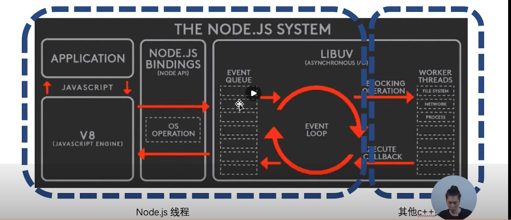

## 非阻塞I/O
- I/O 即 Input/Output, 一个系统的输入和输出
- 阻塞I/O和非阻塞I/O的区别在于系统接收输入再到输出期间，能不能接收其他输入
  - 排队打饭的食堂阿姨是阻塞I/O
  - 餐厅点菜的服务生是非阻塞I/O 
  - 输入是点菜，输出是端菜
- 理解非阻塞I/O的要点在于
  - 确定一个进行Input/Output的系统
  - 思考在I/O过程中，能不能进行其他I/O

## NodeJS System

- 图片左边基本都是在一个Node.js线程里完成的（除了你的应用程序又开了一个新的线程）
- nodejs所有的I/O操作都是非阻塞的，它会把大量的计算能力分发到其他C++线程去计算，等到其他C++线程计算完毕后再把结果回调到nodejs线程，nodejs线程再把结果返回给应用程序
- 左边是点菜员（服务生），右边则是厨师、洗碗工等

## 异步编程之callback
- 回调函数格式规范
  - error-first callback
  - Node-style callback
- 第一个参数是error, 后面的参数才是结果
- npm: async callback一个比较严重的问题是异步流程控制
